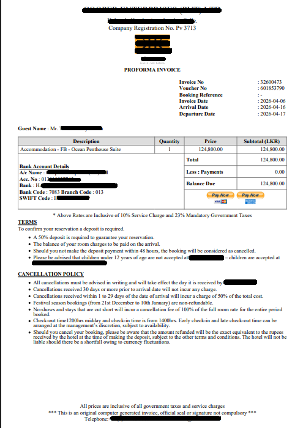
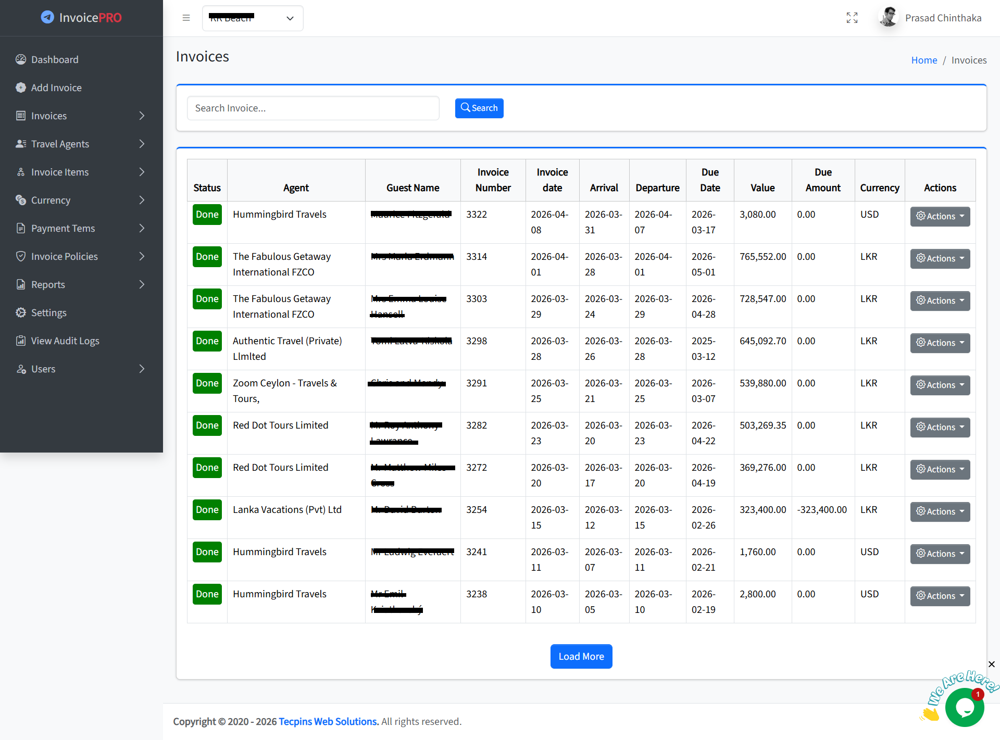
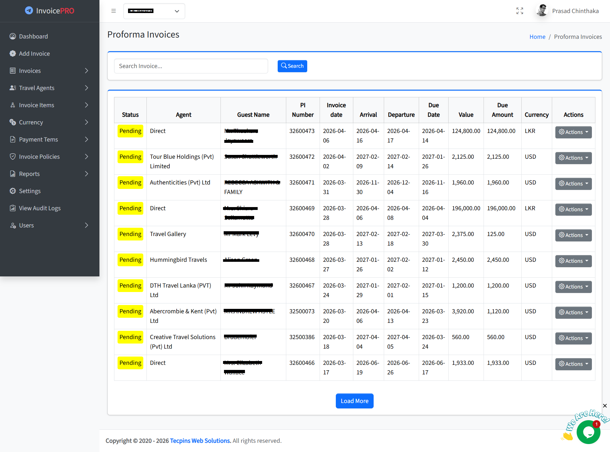
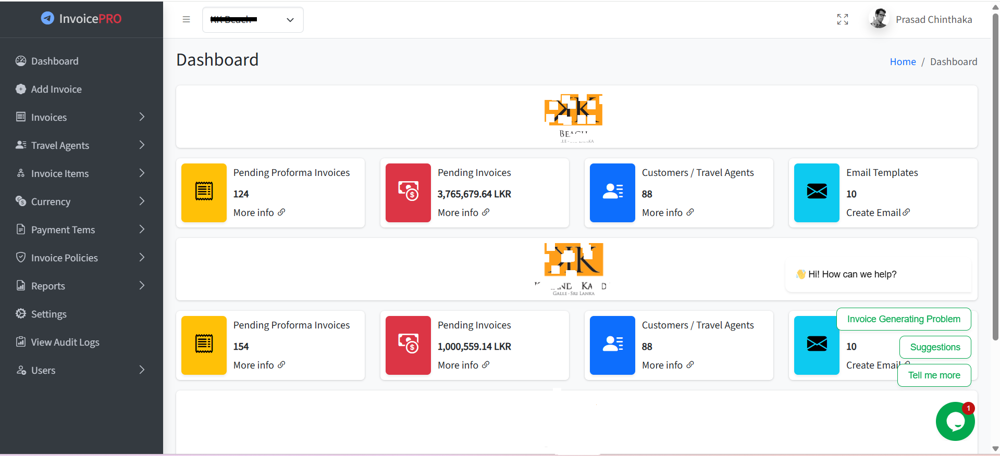
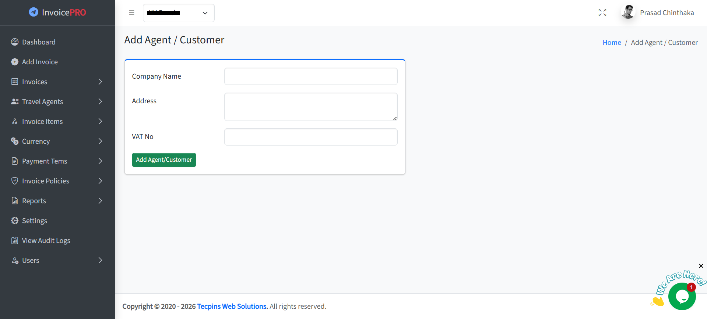
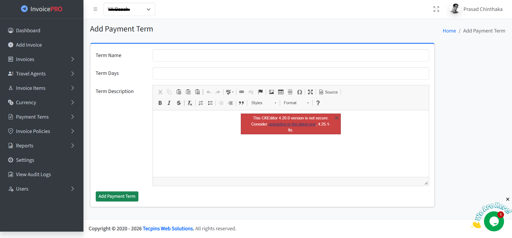
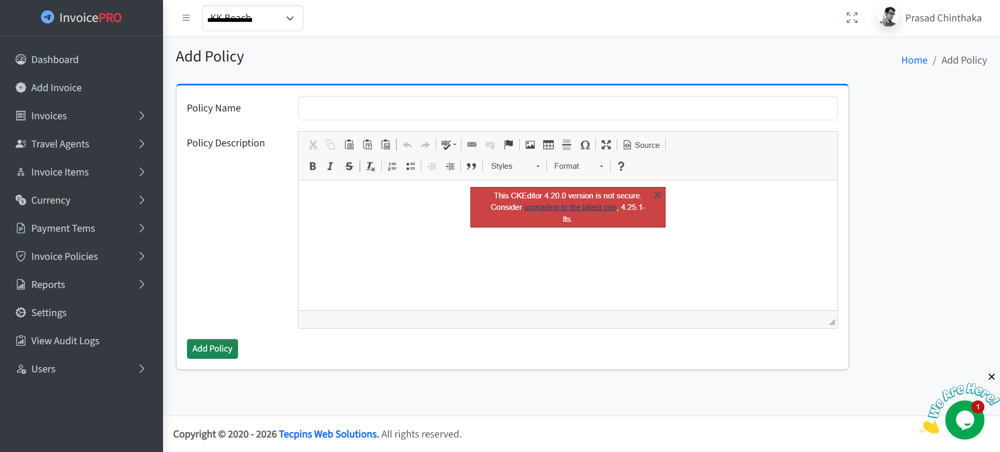

# Proforma, Invoice & Tax Invoice Management System – KK Collection

A professional financial billing solution developed for **KK Collection** to manage the complete invoicing lifecycle. This system provides the accounts team with full control over payment tracking and document conversion, ensuring a professional billing experience for travel agents and direct guests.

---

## 🚀 Key Features & Workflow

### **1. Professional Invoicing Lifecycle**
* **Proforma Generation:** Quickly create detailed Proforma Invoices for inquiries and bookings.
* **Document Conversion:** Effortlessly convert a Proforma Invoice into a formal **Invoice** or a **Tax Invoice** as the transaction progresses, maintaining data integrity throughout the process.

### **2. Controlled Payment Links (Manual Integration)**
* **Custom Link Management:** The admin panel allows staff to manually add and manage payment links (PayNow buttons) for each invoice. 
* **Guest Convenience:** Once the link is added, guests can pay directly from the PDF invoice they receive via Email or WhatsApp. This gives the hotel full control over which payment method is offered to which guest.

### **3. Smart Status Tracking & Priority Dashboard**
* **Visual Status Alerts:** * 🟡 **Pending (Yellow):** Invoices awaiting payment.
    * 🟢 **Done (Green):** Successfully settled invoices.
* **Smart Sorting:** To streamline the workflow, the system automatically prioritizes "Pending" invoices at the top of the list, making it easy for the finance team to identify outstanding payments at a glance.

### **4. Agent & Policy Management**
* **Agent Directory:** Manage a database of Travel Agents for quick billing and commission tracking.
* **Flexible Policies:** Custom modules to add specific terms, conditions, and hotel policies to each document.

---

## 🛠 Technology Stack
* **Backend:** PHP (Core) & MySQL
* **Frontend:** Responsive Admin Dashboard (HTML5, CSS3, Bootstrap)
* **Features:** Manual Payment Link Integration, Dynamic PDF Generation, Advanced Sorting Algorithms.

---

## 📸 System Walkthrough
> *The following screenshots showcase the interface and management capabilities of the system.*

### **Invoicing Modules**
| Proforma Invoice | Invoice List (Priority Sorting) |
|---|---|
|  |  |

| Add New Invoice | List of Proformas |
|---|---|
|  |  |

### **Administration & Settings**
| Admin Dashboard | Agent Management |
|---|---|
|  |  |

| Terms & Conditions | Policy Management |
|---|---|
|  |  |

---

## 🔒 Confidentiality Notice
This is a proprietary financial system developed for **KK Collection** via **Tecpins Web Solutions**. The source code, encryption logic, and database architecture are private and not available for public distribution.

---

### 👨‍💻 Developed By
**Prasad Chinthaka** *Professional Accountant & Full-Stack Developer* [Tecpins Web Solutions](https://tecpinswebsolutions.lk/)
